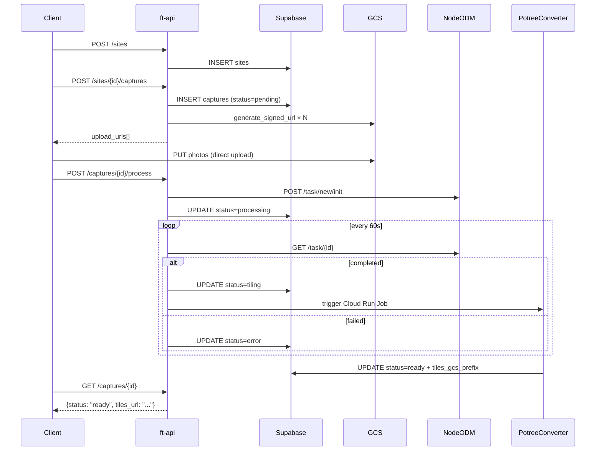

# Drone API Reference — Phase 5

Full endpoint reference for the drone 3D mapping module.

## Base URL

```
/api/v1/drone
```

All endpoints require a Firebase ID token in the `Authorization: Bearer <token>` header.
`customerId` is always extracted from the JWT — never from the request body.

---

## Sites

### POST /api/v1/drone/sites

Create a new named site.

**Request**
```json
{ "name": "Tower Block A" }
```

**Response 201**
```json
{
  "site_id": "uuid",
  "name": "Tower Block A",
  "capture_count": 0,
  "created_at": "2026-05-01T10:00:00Z"
}
```

**Errors:** 401 (missing/invalid token), 422 (missing name)

---

### GET /api/v1/drone/sites

List all sites for the authenticated tenant.

**Response 200**
```json
{
  "sites": [
    {
      "site_id": "uuid",
      "name": "Tower Block A",
      "capture_count": 3,
      "last_capture_at": "2026-04-20T09:00:00Z"
    }
  ]
}
```

---

### DELETE /api/v1/drone/sites/{siteId}

Delete a site. Returns 409 if the site has captures.

**Response 200**
```json
{ "deleted": true }
```

**Errors:** 404 (site not found), 409 (captures exist)

---

## Captures

### POST /api/v1/drone/sites/{siteId}/captures

Create a capture record and return one pre-signed GCS PUT URL per photo.
Photos are uploaded directly from the browser — ft-api never handles binary data.

**Request**
```json
{
  "captured_at": "2026-04-20T09:00:00Z",
  "photo_count": 312,
  "filenames": ["DJI_0001.JPG", "DJI_0002.JPG"]
}
```

**Response 201**
```json
{
  "capture_id": "uuid",
  "status": "pending",
  "upload_urls": [
    { "filename": "DJI_0001.JPG", "url": "https://storage.googleapis.com/..." },
    { "filename": "DJI_0002.JPG", "url": "https://storage.googleapis.com/..." }
  ]
}
```

**Constraints:**
- `photo_count` ≤ 500 (FR-06); returns 422 if exceeded
- `filenames` length must equal `photo_count`
- Signed URL TTL: 15 minutes

**Errors:** 404 (site not found / wrong tenant), 422 (validation failure)

---

### POST /api/v1/drone/sites/{siteId}/captures/{captureId}/process

Trigger ODM processing. Call after all photo uploads are confirmed.

**Request:** empty body `{}`

**Response 202**
```json
{
  "capture_id": "uuid",
  "status": "processing",
  "odm_task_id": "odm-task-uuid"
}
```

**State machine:** capture must be in `pending` or `uploading` state.

**Errors:** 404 (not found), 409 (wrong status), 503 (NodeODM unreachable)

---

### GET /api/v1/drone/sites/{siteId}/captures/{captureId}

Get capture status, tile URL, and metadata.

**Response 200 — ready**
```json
{
  "capture_id": "uuid",
  "site_id": "uuid",
  "captured_at": "2026-04-20T09:00:00Z",
  "status": "ready",
  "photo_count": 312,
  "tiles_url": "https://storage.googleapis.com/flowterra-drone-dev/captures/uuid/tiles/",
  "metadata": { "gsd_cm": 2.4, "odm_version": "3.4.0" }
}
```

**Response 200 — processing**
```json
{
  "capture_id": "uuid",
  "status": "processing",
  "tiles_url": null,
  "metadata": { "odm_progress": 42 }
}
```

**Response 200 — error**
```json
{
  "capture_id": "uuid",
  "status": "error",
  "tiles_url": null,
  "metadata": { "error": "too_few_features — ensure 70%+ image overlap" }
}
```

**Status values:** `pending | uploading | processing | tiling | ready | error`

`tiles_url` is non-null only when `status = "ready"`.

**Errors:** 404 (not found or cross-tenant access)

---

## Data Flow



---

## Environment Variables

| Variable | Description |
|---|---|
| `SUPABASE_URL` | Supabase project URL |
| `SUPABASE_SERVICE_ROLE_KEY` | Supabase service role key (bypasses RLS for server-side ops) |
| `GCS_DRONE_BUCKET` | GCS bucket name for drone data |
| `NODE_ODM_URL` | NodeODM base URL (default: `http://flowterra-nodeodm-vm:3000`) |
| `NODE_ODM_TOKEN` | NodeODM auth token |
| `POTREE_CONVERTER_JOB_URL` | Cloud Run Job URL for PotreeConverter trigger |
| `DISABLE_ODM_POLLER` | Set to any value to disable background poller (used in tests) |
